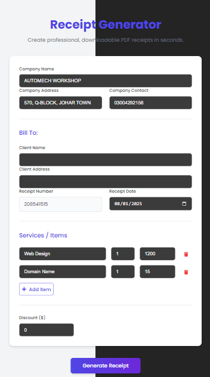

# Receipt Generator for Automobile Workshop

A simple and efficient receipt generator designed for automobile workshops. This tool allows workshop owners or employees to quickly generate professional receipts for their customers, reducing manual effort and ensuring accuracy.

---

## Features

- Generate printable receipts for automobile services.
- Easy-to-use interface for quick data entry.
- Customizable fields for workshop name, customer details, and services provided.
- Auto-calculation of total amounts.
- Option to save or export receipts as PDF.

---

## Technologies Used

- **Frontend:** [e.g., React, HTML, CSS, JavaScript]  
- **Backend:** [e.g., Node.js, Express]  
- **Database:** [e.g., MongoDB, SQLite] (if applicable)  
- **Others:** [e.g., PDF generation library]

---

## Installation

1. Clone the repository:
   ```bash
   git clone https://github.com/your-username/receipt-generator.git



